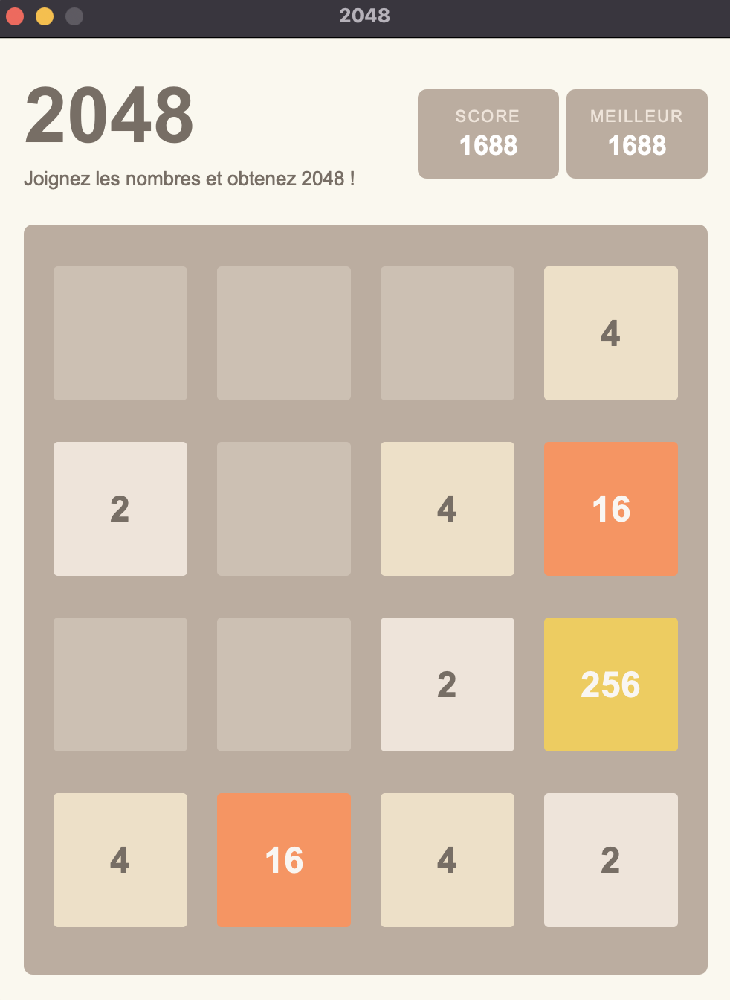

# 2048 Game

Une implémentation du jeu 2048 en Python utilisant PyQt6.



## Description

Ce projet est une réimplémentation du jeu 2048.

## Prérequis

- Python 3.6 ou supérieur
- PyQt6

## Installation

1. Clonez le repository :
```bash
git clone https://github.com/r00tmee/2048.git
cd 2048
```

2. Installez les dépendances :
```bash
pip install -r requirements.txt
```

## Lancement

Pour démarrer le jeu, exécutez :
```bash
python main.py
```

## Contrôles

- Flèche gauche : déplacer les tuiles vers la gauche
- Flèche droite : déplacer les tuiles vers la droite
- Flèche haut : déplacer les tuiles vers le haut
- Flèche bas : déplacer les tuiles vers le bas

## Structure du Projet

```
2048/
├── main.py           # Point d'entrée de l'application
├── game_logic.py     # Logique du jeu
├── game_widget.py    # Interface graphique
├── constants.py      # Constantes et styles
└── requirements.txt  # Dépendances
```

## Contribution

Les contributions sont les bienvenues ! N'hésitez pas à ouvrir une issue ou à soumettre une pull request.

## Licence

Ce projet est sous licence MIT. Voir le fichier `LICENSE` pour plus de détails. 